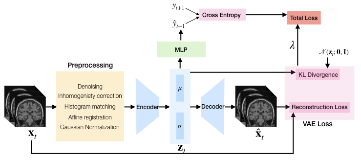

# Early Prediction of Alzheimer’s Disease Progression Using Variational Autoencoders (MICCAI 2019)

```
Citation
 @article{basu_wagstyl_zandifar_collins_romero_precup_2019,
 title={Early prediction of alzheimer’s disease progression using variational autoencoders},
 DOI={10.1007/978-3-030-32251-9_23}, journal={Lecture Notes in Computer Science},
 author={Basu, Sumana and Wagstyl, Konrad and Zandifar, Azar and Collins, Louis and Romero, Adriana and Precup, Doina},
 year={2019}, 
 pages={205–213}
 } 
 ```

## Paper Summary

_**Assumption:**_
This paper is based on the assumption that signs of Alzheimer’s can be captured by MRIs and those physiological changes in the brain start way before the symptoms surface.

_**Questions:**_
Given this assumption, can we predict if someone is at the risk of getting Alzheimer’s?
If yes, which part of the brain our model looks at when making a correct prediction. Does that make sense from the clinical perspective and if it does, that might guide the doctors for early prediction of the disease.

_**Research Approach:**_
To answer the first question, we trained a VAE with a downstream task of predicting the future disease label. VAE learns a distribution over the latent space that captures the stochasticity of the disease evolution trajectories. The idea is while learning the latent distribution, similar images will end up close to each other. Since we also trained the classifier together, the representations predicting similar outcomes are expected to end up close to each other in the latent space. So, given an MRI we are going to find its latent representation and future disease label prediction. If someone is healthy today, but the representation lies close to diseased patients, on repeating the MRI -> latent representation -> future disease label experiment, the predictions might vary. That is when the model is confused and the patient might be at risk of developing the disease.

To answer the second, we have visualized activation maps.

---

Paper Link: https://rdcu.be/bT8Yt

***Workflow***

 

***Quantitative Analysis***


***Qualitative Analysis***

* Which part of the brain some of the best peforming models look at?

  * When a healthy person got the disease:

  

The person was healthy when the MRI was taken, but got diseased after 6 months. Our VAE model correctly predicted that the person will get diseased with 91% confidence.

(For further details, look into the *Visualization* folder. It contains the code and visualzation videos for the visualization of activation maps shown in the qualitative results.)
